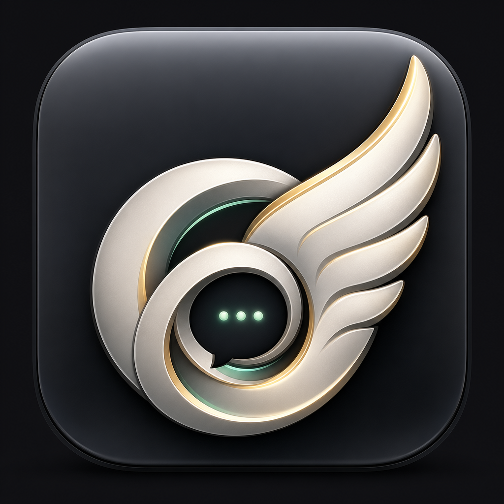

# Hermes Chat Launcher
<p align="center">
  
</p>


A tiny macOS launcher for running [Open WebUI](https://openwebui.com/) as a local chat UI for Hermes Agent.

Double-click `Hermes Chat.app` and it will:

1. Start Hermes Agent's OpenAI-compatible API server on `http://127.0.0.1:8642/v1` if it is not already running.
2. Start Docker Desktop if Docker is not ready.
3. Start or create the `open-webui` Docker container configured to talk to Hermes.
4. Open `http://localhost:3000` in your browser.

This is intentionally not a fork of Open WebUI. It uses stock Open WebUI and only handles local macOS startup orchestration.

## What is Open WebUI?

[Open WebUI](https://openwebui.com/) is a self-hosted AI chat interface. It gives you a polished ChatGPT-like web app for talking to local or remote models through providers such as Ollama and OpenAI-compatible APIs.

Hermes Chat Launcher uses Open WebUI as the front end and points it at Hermes Agent's local OpenAI-compatible API. In practice: Open WebUI provides the chat UI; Hermes provides the agent behind it.

## Quick install with Hermes

Copy this prompt into Hermes:

```text
Install Hermes Chat Launcher from https://github.com/dannyshmueli/hermes-chat-launcher on my Mac. Clone the repo, run ./scripts/install-macos-app.sh, verify /Applications/Hermes Chat.app exists, verify the icon is installed, launch it once, and confirm Hermes API and Open WebUI are reachable.
```

Hermes will install the launcher app, start the local services, and open the chat UI.

## Requirements

- macOS
- Docker Desktop
- Hermes Agent installed and configured (`hermes` on PATH)

## Install

```bash
git clone https://github.com/dannyshmueli/hermes-chat-launcher.git
cd hermes-chat-launcher
./scripts/install-macos-app.sh
```

Then open:

```text
/Applications/Hermes Chat.app
```

The launcher opens your existing Chrome PWA/app shortcut when present:

```text
~/Applications/Chrome Apps.localized/Hermes Workspace.app
```

If that app is not present, it falls back to a new Chrome app-style window with:

```bash
open -na "Google Chrome" --args --app="http://localhost:3000"
```

You can override the Chrome app target:

```bash
CHROME_APP_NAME="Open WebUI" ~/bin/hermes-chat-launcher.sh
CHROME_APP_PATH="$HOME/Applications/Chrome Apps.localized/My App.app" ~/bin/hermes-chat-launcher.sh
```

If macOS blocks the unsigned app, right-click it once and choose **Open**.

## What gets installed

- `/Applications/Hermes Chat.app`
- `~/bin/hermes-chat-launcher.sh`

Logs:

- `~/.hermes/logs/hermes-chat-launcher.log`
- `~/.hermes/logs/openwebui-hermes-api.log`

## Manual run

```bash
~/bin/hermes-chat-launcher.sh
```

## Open WebUI configuration

The launcher creates/runs this Docker container if it does not exist:

- container name: `open-webui`
- image: `ghcr.io/open-webui/open-webui:main`
- browser URL: `http://localhost:3000`
- backend URL from inside Docker: `http://host.docker.internal:8642/v1`
- model exposed by Hermes: `hermes-agent`

## Verification

```bash
curl http://127.0.0.1:8642/health
curl http://127.0.0.1:8642/v1/models
curl http://127.0.0.1:3000/api/config
```

## Icon

The icon is generated art for this launcher: a Hermes wing plus AI/chat gateway motif. It intentionally avoids copying the OpenAI logo exactly.

macOS icon notes:

- Source PNG: `assets/hermes-chat-icon.png`
- README hero: `assets/readme-hero.png`
- App icon: `assets/HermesChat.icns`
- Generated via Apple's `iconutil` from a `.iconset` with standard sizes up to `512x512@2x`.

## License

MIT for this launcher code and generated icon asset.

Open WebUI itself is a separate project with its own license and branding requirements. This launcher does not redistribute or modify Open WebUI; it pulls and runs the upstream Docker image.
